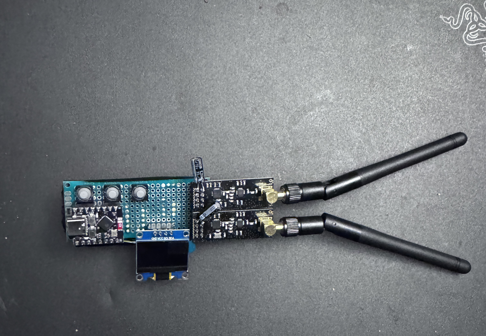
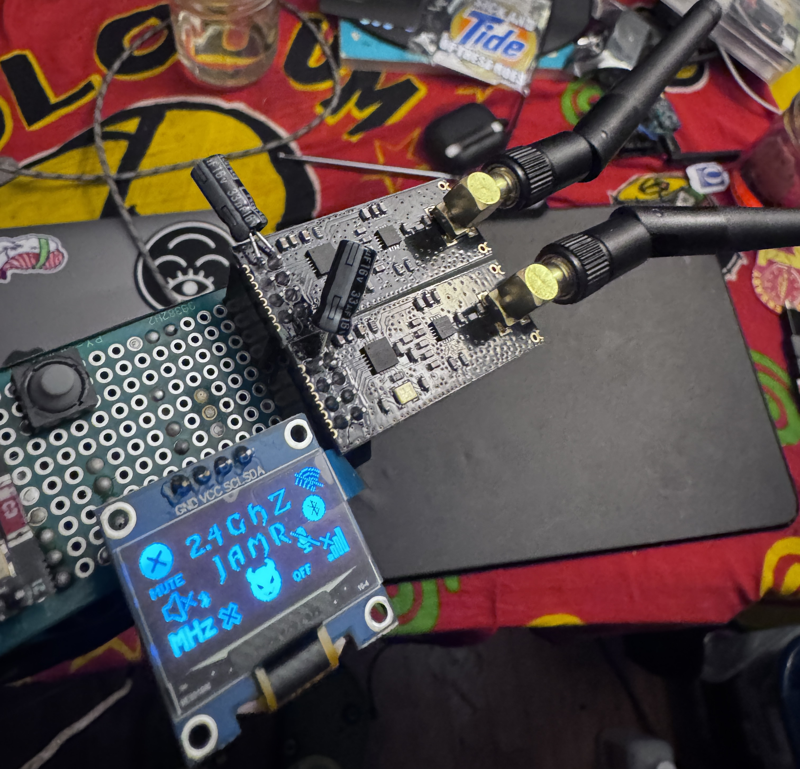
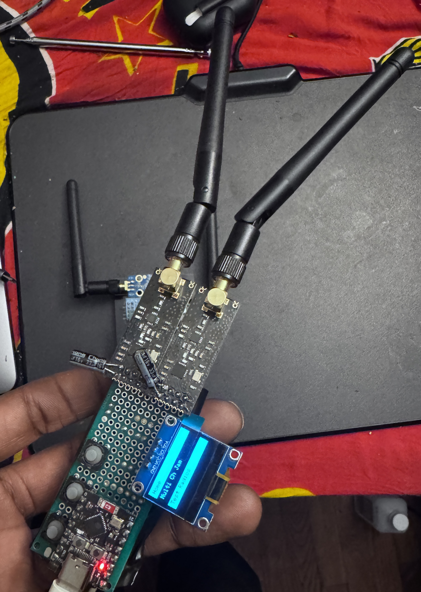
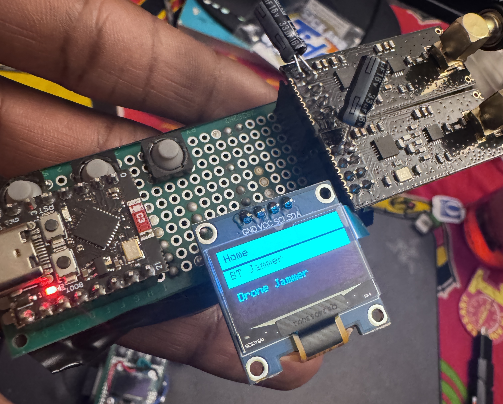
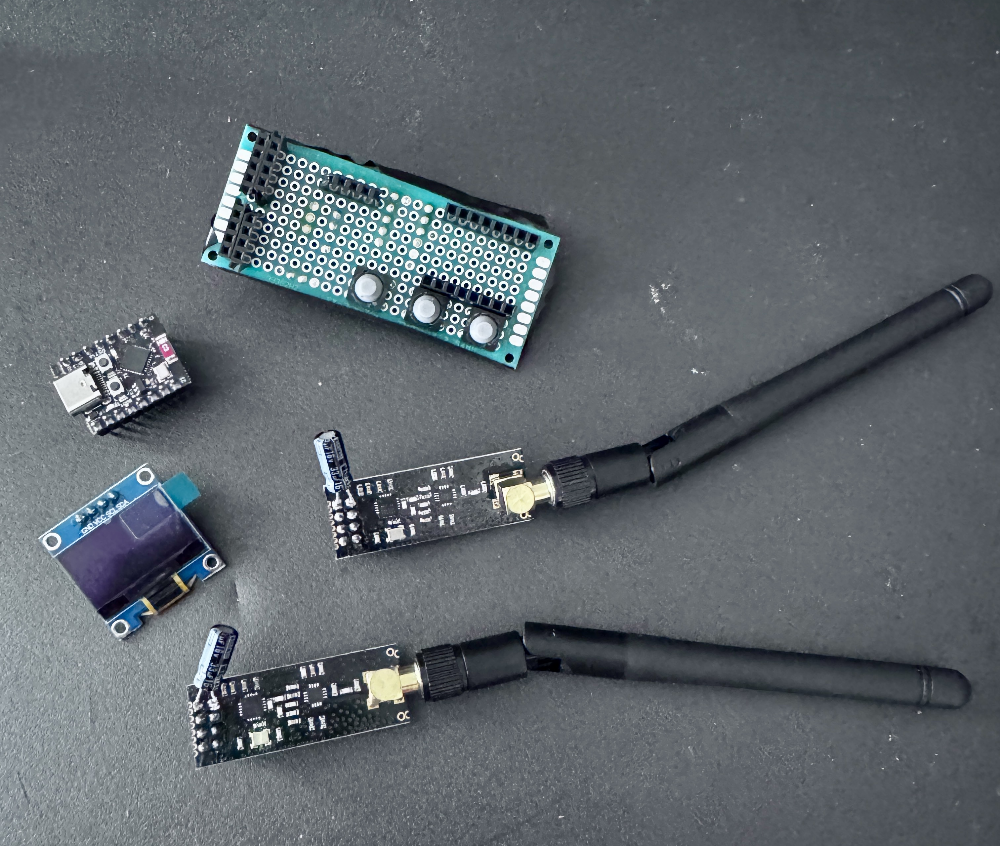

# cypher-jammer-mini
Tiny WiFi + Bluetooth Jammer w/ ESP32-C3 SuperMini

### Open-source Wireless Jamming Pentesting Device using ESP32-C3 SuperMini & 2 NRFL01+PA+LNA Modules

This is an ESP32 wireless pentesting device that generates 2.4GHz signals at various channels. This is an upgrade to the previous cypher-jammer, and adds an SSD1306 display and buttons. This allows much more flexibility when using the device.

** PCB COMING SOON **

### Order my PCBs from other projects from PCBWay & get a $10 coupon ^_^ : https://pcbway.com/g/87Pi52









 
 **WARNING!!! JAMMING IS ILLEGAL**
 ---
# WHAT DOES IT DO?

**IT CREATES NOISE SIGNAL TO JAM BLUETOOTH, DRONES, AND WIFI USING NRF24L01 AND ESP32 IN RANGE 2.4GHZ DEVICES , EFFECTS MAY VARY DEPENDS ON DEVICE BLUETOOTH VERSIONS **

---

---
## REQUIRED DEVICE AND MODULE:
1. `2pc  NRF24LO1+PA+LNA`
- https://amzn.to/41cax0I

2. `1pc ESP32-C3 SuperMini`
- https://amzn.to/4ild5j6


3. `10UF-100UF CAPACITOR ` 
- https://amzn.to/4aUpl7v

4. `SSD1306 128x64 .96in Display ` 
- https://amzn.to/3QeGX4M	

---

## PINS TO ATTACH NRF24L01 TO ESP32 C3 SuperMini
ESP32 C3 only has 1 SPI bus to use, so you connect both NRF24s the the same SPI pins.

### FOR 2 NRF24s
+ Radio 1 ` SPI= SCK = 4, MISO =5, MOSI = 6 ,CS =21 ,CE = 20`
+ Radio 2 ` SPI= SCK = 4, MISO =5, MOSI = 6 ,CS =10 ,CE = 7`


** edit code here to change radios **
// radio(CE, CS)
RF24 radio(20, 21, 16000000);  // Radio 1 VSPI
RF24 radio2(7, 10, 16000000);  // Radio 2 HSPI

---

## SOME NOTES

* NRF24 CAN DO 125 CHANNELS & YOU CAN EDIT IT IN CODE
- BLUETOOTH CLASSIC 80 CHANNELS
+ BLE USES 40 CHANNELS
* WIFI USES 1-14 CHANNELS
* DRONE 2.4GHZ 1-125 SO YOU NEED TO EDIT CODE TO HOPE 125 CHANNELS
```
	
